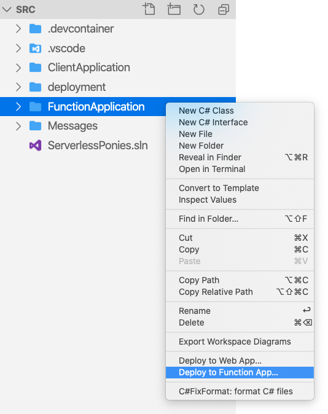
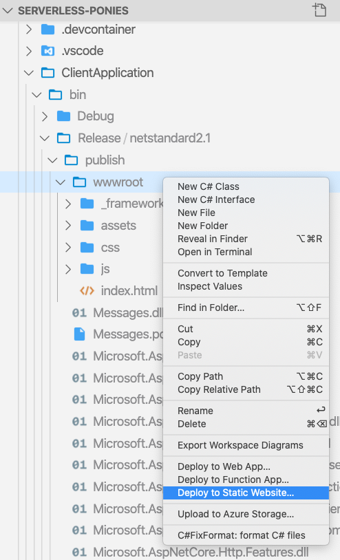

# Serverless Ponies 🐴

This repo contains a work-in-progress game I'm building together with my 9 year-old daughter Lisa. It's a sample of how to create a serverless web application using Azure Functions on the server-side and Blazor WebAssembly on the client-side (hosted in an Azure Storage static website).

## Getting started

This repository contains a VS Code `devcontainer.json` file which VS Code can use to create a sandbox that contains all the extensions required to deploy Serverless Ponies to Azure. 

To use the [development container](https://code.visualstudio.com/docs/remote/containers) make sure you've got the following prerequisites installed:

- VS Code; including the *Visual Studio Code Remote - Containers* extension
- Docker

### Open solution in container

Open the `src` folder in VS Code. VS Code will ask you if you want to re-open the folder in the development container:

Click **Reopen in Container** to let VS Code create the container. This may take some time, and a progress notification will provide status updates.

### Name Azure resources

When the folder has reopened in the development container, open the `src/deployment/deploy.azcli` file in the editor. The script contains a `uniqueSuffix` variable that you should change to some other random number to avoid any naming collisions with other deployed instances of the solution.

Next, open up `src/ClientApplication/Program.cs` and change the value of the `ENVIRONMENT_SUFFIX` constant to the same number you choose in the deployment script.

### Create Azure resources

Open a new Terminal window in VS Code and navigate to the `src/deployment` folder.

Use `az login` to log in to your Azure subscription.

Then run the `deploy.azcli` script to deploy the required Azure resources (Function App, SignalR Service and a Storage Account).

### Deploy the back-end to Azure Functions

Once the deployment script has completed, right-click the *FunctionApplication* folder and select **Deploy to Function App**:

VS Code will then ask you to select a subscription and a Function App. Select the *serverlessponiesxxxx* Function App that was created by the `deploy.azcli` script.

VS Code will now restore, build and publish the solution, and upload the *FunctionApplication* output to the Azure Function App.

### Deploy the front-end to Azure Storage Static Website

Right-click the *ClientApplication/bin/Release/netstandard2.1/publish/wwwroot* folder and select **Deploy to Static Website...**:

VS Code will ask you again to select a subscription and then a storage account. Select the *serverlessponiesxxxx* Storage Account that was created by the `deploy.azcli` script.

Once the front-end is deployed, VS Code will show the address at which the game can be played:

